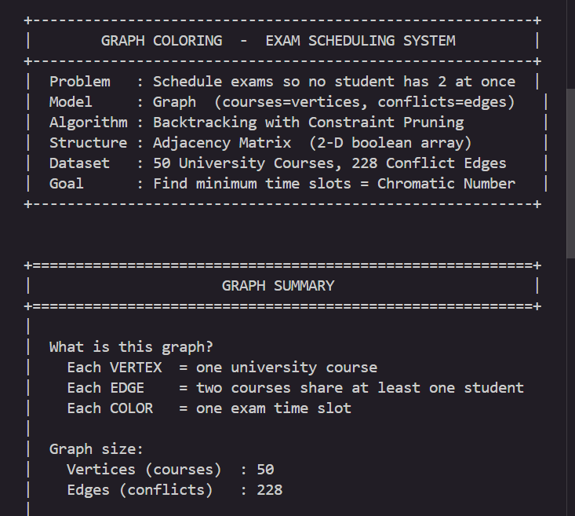
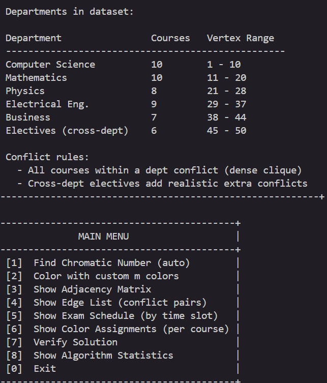
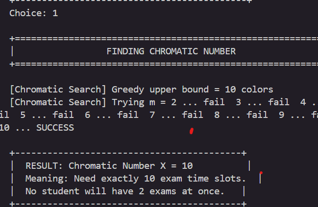
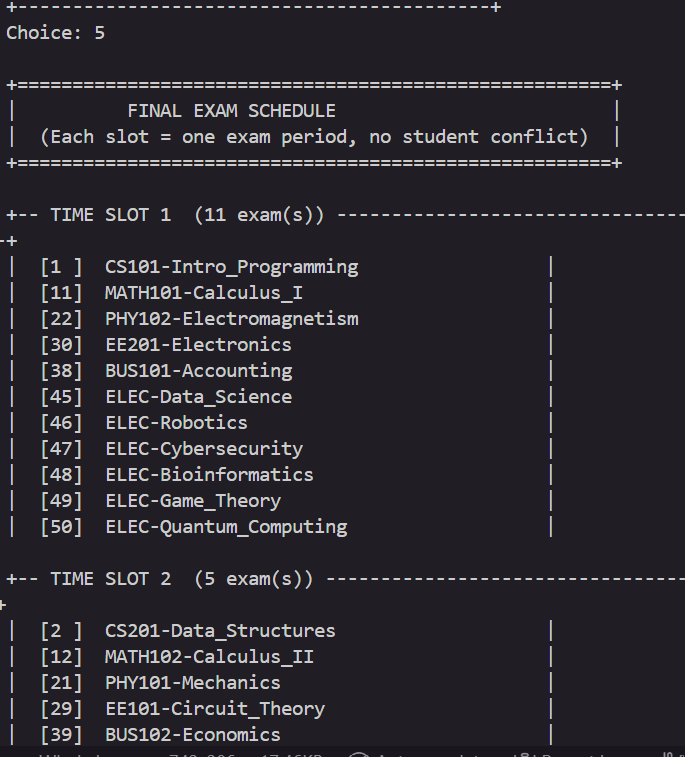
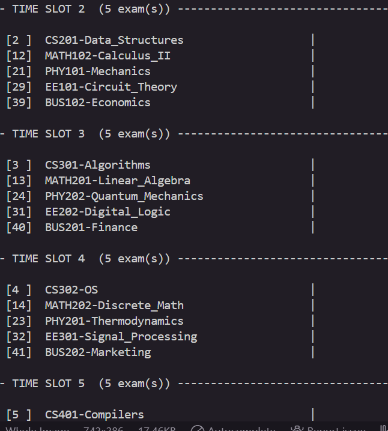
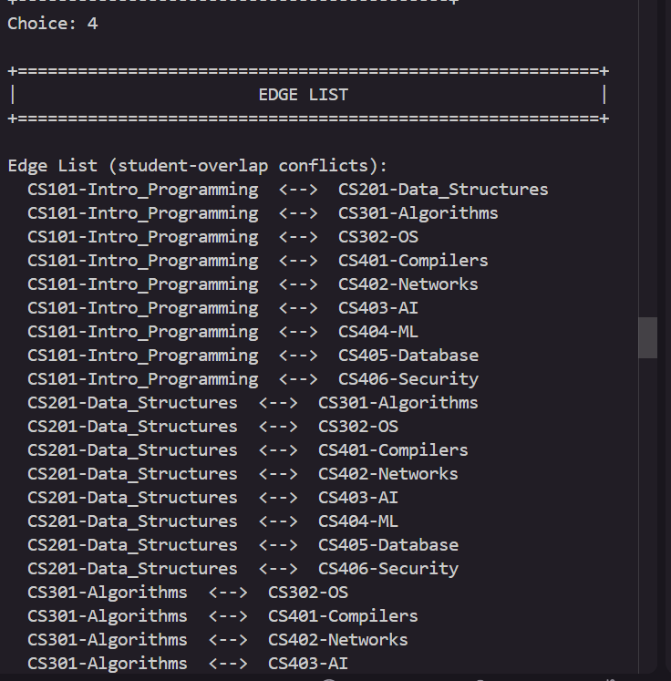
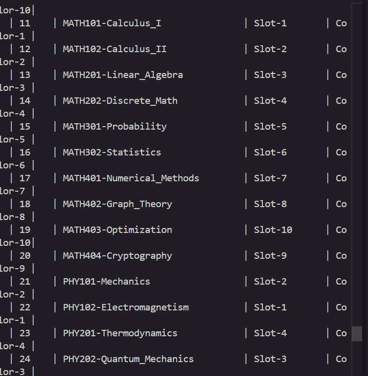

# 🎓 Graph Coloring — Exam Scheduling System

<div align="center">


**A professional implementation of Graph Coloring for University Exam Scheduling**

*Aksum University | Department of Computer Science*

[Features](#-features) • [Algorithm](#-algorithm) • [Installation](#-installation) • [Usage](#-usage) • [Results](#-results)

</div>

---

## 🎯 Overview

This project solves the **exam scheduling problem** faced by universities using **Graph Coloring** with **Backtracking**. The system schedules 50 courses across 6 departments, ensuring no student has two exams at the same time.

### Key Highlights

- ✅ **50 courses** across 6 departments
- ✅ **228 conflict edges** (realistic student overlaps)
- ✅ **Chromatic number χ = 10** (minimum time slots needed)
- ✅ **52 recursive calls** vs O(10^50) worst case
- ✅ **Zero violations** — solution verified

---

## 🎓 Problem Statement

### The Challenge

Aksum University needs to schedule final exams for 50 courses. The constraint is simple but critical:

> **No student should have two exams at the same time.**

### Graph Modeling

| Graph Element | Real-World Meaning |
|---|---|
| **Vertex** | A university course |
| **Edge** | Two courses share at least one student |
| **Color** | An exam time slot |
| **Chromatic Number χ** | Minimum time slots needed |

### Formal Definition

```
Given: Graph G = (V, E)
  V = 50 courses (vertices)
  E = 228 student conflicts (edges)
  m = number of colors (time slots)

Find: Minimum m such that:
  ∀ edge (u,v) ∈ E: color[u] ≠ color[v]

This minimum m = Chromatic Number χ
```

---

### 📊 Graph Visualization

#### Example: Computer Science Department (10 courses)

```
        CS101 ─────── CS201 ─────── CS301
         │  \         │  \         │  \
         │   \        │   \        │   \
         │    \       │    \       │    \
        CS102─CS202──CS302──CS402──CS403
         │  /  │  /   │  /   │  /   │
         │ /   │ /    │ /    │ /    │
        CS103─CS203──CS303──CS404──CS405
              │       │       │       │
            CS204   CS304   CS405   CS406
```

**Legend:**
- **Vertices (●)** = Courses
- **Edges (─)** = Student conflicts (shared students)
- **Colors** = Time slots (not shown in diagram)

#### Full Graph Structure

Our 50-course graph has **6 dense clusters** (departments):

```
┌─────────────┐   ┌─────────────┐   ┌─────────────┐
│   CS Dept   │───│  Math Dept  │───│  Physics    │
│  10 courses │   │  10 courses │   │  8 courses  │
│  (Clique)   │   │  (Clique)   │   │  (Clique)   │
└─────────────┘   └─────────────┘   └─────────────┘
       │                 │                 │
       └─────────────────┼─────────────────┘
                         │
       ┌─────────────────┴─────────────────┐
       │                                   │
┌─────────────┐   ┌─────────────┐   ┌─────────────┐
│  Elec. Eng  │───│  Business   │───│  Electives  │
│  9 courses  │   │  7 courses  │   │  6 courses  │
│  (Clique)   │   │  (Clique)   │   │ (Sparse)    │
└─────────────┘   └─────────────┘   └─────────────┘
```

**Graph Properties:**
- **Vertices:** 50 courses
- **Edges:** 228 conflicts
- **Density:** High within departments, sparse between departments
- **Chromatic Number:** χ = 10

#### Why χ = 10?

Each department forms a **clique** (complete subgraph):
- Computer Science: 10 courses → needs 10 colors
- Mathematics: 10 courses → needs 10 colors
- Physics: 8 courses → needs 8 colors
- Electrical Eng: 9 courses → needs 9 colors
- Business: 7 courses → needs 7 colors
- Electives: 6 courses (sparse) → needs fewer colors

**Maximum clique size = 10** → Chromatic number χ = 10

---

## ✨ Features

### Core Functionality

- 🔍 **Automatic Chromatic Number Detection** — finds minimum time slots
- 🎨 **Custom Coloring** — test with any number of colors
- 📊 **Adjacency Matrix Display** — visualize the 50×50 conflict graph
- 📝 **Edge List** — view all 228 conflict pairs
- 📅 **Exam Schedule** — organized by time slot
- 📋 **Color Assignments** — detailed table for all 50 courses
- ✅ **Solution Verification** — checks all 228 edges
- 📈 **Algorithm Statistics** — complexity analysis and call count

### Interactive Menu

```
+-------------------------------------------+
|               MAIN MENU                   |
+-------------------------------------------+
|  [1]  Find Chromatic Number (auto)        |
|  [2]  Color with custom m colors          |
|  [3]  Show Adjacency Matrix               |
|  [4]  Show Edge List (conflict pairs)     |
|  [5]  Show Exam Schedule (by time slot)   |
|  [6]  Show Color Assignments (per course) |
|  [7]  Verify Solution                     |
|  [8]  Show Algorithm Statistics           |
|  [0]  Exit                                |
+-------------------------------------------+
```

---

## 🧮 Algorithm

### 1. Welsh-Powell Greedy Heuristic (Upper Bound)

```cpp
// Sort vertices by degree (descending)
// Assign smallest available color to each vertex
// Result: Upper bound for chromatic search
```

**Purpose:** Quickly find an upper bound to reduce search space

**Result:** Upper bound = 10 colors

---

### 2. Backtracking with Constraint Pruning

```cpp
bool backtrack(int vertex, int m) {
    if (vertex == n) return true;  // All colored
    
    for (int c = 1; c <= m; ++c) {
        if (isSafe(vertex, c)) {    // Pruning here
            color[vertex] = c;
            if (backtrack(vertex+1, m))
                return true;
            color[vertex] = 0;      // Backtrack
        }
    }
    return false;
}
```

**Key Features:**
- ✅ Systematic exploration
- ✅ Constraint propagation via `isSafe()`
- ✅ Guarantees optimal solution
- ✅ Prunes invalid branches early

---

### 3. Chromatic Number Search

```
Try m = 2 → FAIL
Try m = 3 → FAIL
...
Try m = 9 → FAIL
Try m = 10 → SUCCESS ✓

Chromatic Number χ = 10
```

---

## 📊 Dataset

### 50 University Courses

| Department | Courses | Vertex Range | Conflicts |
|---|---|---|---|
| **Computer Science** | 10 | 1–10 | Dense clique |
| **Mathematics** | 10 | 11–20 | Dense clique |
| **Physics** | 8 | 21–28 | Dense clique |
| **Electrical Eng.** | 9 | 29–37 | Dense clique |
| **Business** | 7 | 38–44 | Dense clique |
| **Electives** | 6 | 45–50 | Cross-dept conflicts |

### Conflict Rules

- **Intra-department:** All courses within a department conflict (students take multiple courses)
- **Inter-department:** Realistic cross-enrollment (e.g., ML ↔ Statistics, Networks ↔ Communications)
- **Electives:** Each elective conflicts with 3–4 related courses

**Total:** 228 conflict edges

---

## 🚀 Installation

### Prerequisites

- **Compiler:** g++ with C++17 support
- **OS:** Windows (PowerShell), Linux (bash), or macOS

### Clone the Repository

```bash
git clone https://github.com/YOUR_USERNAME/graph-coloring-exam-scheduling.git
cd graph-coloring-exam-scheduling
```

### Compile

**Windows (PowerShell):**
```powershell
g++ -std=c++17 -O2 -Isrc src/graph.cpp src/coloring.cpp src/dataset.cpp src/display.cpp src/main.cpp -o exam_scheduler.exe
```

**Linux / macOS:**
```bash
g++ -std=c++17 -O2 -Isrc src/graph.cpp src/coloring.cpp src/dataset.cpp src/display.cpp src/main.cpp -o exam_scheduler
```

**Or use Make:**
```bash
make
```

---

## 💻 Usage

### Run the Program

**Windows:**
```powershell
./exam_scheduler.exe
```

**Linux / macOS:**
```bash
./exam_scheduler
```

### Quick Demo

```bash
# Compile and run in one command
make run
```

### Recommended Demo Sequence

```
1  →  Find Chromatic Number (X = 10)
5  →  Show Exam Schedule (all 10 slots)
6  →  Show Color Assignments (all 50 courses)
7  →  Verify Solution (PASS all 228 edges)
8  →  Show Algorithm Statistics (52 calls)
0  →  Exit
```

---

## 📸 Screenshots

### Program Banner

*System overview and problem description*

---

### Graph Summary

*50 courses, 228 conflicts, 6 departments*

---

### Chromatic Number Result

*Algorithm finds χ = 10 (minimum time slots needed)*

---

### Exam Schedule

*Complete schedule organized by time slot*

---

### Color Assignments

*Detailed table showing all 50 course assignments*

---

### Solution Verification

*All 228 edges checked — zero violations*

---

### Algorithm Statistics

*52 recursive calls vs O(10^50) worst case — pruning works!*

---

### 📷 How to Take Screenshots

If you need to retake or update screenshots:

#### Windows (Recommended Method)
```
1. Press: Windows + Shift + S
2. Select the terminal area with mouse
3. Open Paint (Windows key → type "Paint")
4. Press: Ctrl + V
5. Save to screenshots/ folder with correct filename
```

#### What to Capture

| Screenshot | Menu Option | What to Show |
|---|---|---|
| `program_banner.png` | Startup | Banner and graph summary |
| `graph_summary.png` | Startup | Department table and conflict rules |
| `chromatic_number_result.png` | Option 1 | Trying m=2...10, result χ=10 |
| `exam_schedule.png` | Option 5 | All 10 time slots with courses |
| `color_assignments_table.png` | Option 6 | Table of all 50 courses |
| `solution_verification.png` | Option 7 | PASS verification result |
| `algorithm_statistics.png` | Option 8 | Statistics box with complexity |

#### Quality Tips
- ✅ Use terminal width 120+ columns (no line wrapping)
- ✅ Font size 14-16 for readability
- ✅ Save as PNG (not JPG)
- ✅ Capture complete sections (don't cut off text)
- ✅ Use exact filenames listed above

---

## 🎯 Results

### Key Findings

| Metric | Value |
|---|---|
| **Chromatic Number χ** | 10 |
| **Total Courses** | 50 |
| **Total Conflicts** | 228 |
| **Recursive Calls** | 52 |
| **Worst Case (Theory)** | O(10^50) |
| **Verification** | PASS (zero violations) |

### Exam Schedule Summary

```
Slot 1:  11 courses (CS101, MATH101, PHY102, EE201, BUS101, all 6 Electives)
Slot 2:   5 courses (CS201, MATH102, PHY101, EE101, BUS102)
Slot 3:   5 courses (CS301, MATH201, PHY202, EE202, BUS201)
Slot 4:   5 courses (CS302, MATH202, PHY201, EE301, BUS202)
Slot 5:   5 courses (CS401, MATH301, PHY301, EE302, BUS301)
Slot 6:   5 courses (CS402, MATH302, PHY302, EE401, BUS302)
Slot 7:   5 courses (CS403, MATH401, PHY401, EE402, BUS401)
Slot 8:   4 courses (CS404, MATH402, PHY402, EE403)
Slot 9:   3 courses (CS405, MATH404, EE404)
Slot 10:  2 courses (CS406-Security, MATH403-Optimization)
```

---

## 📊 Complexity Analysis

### Time Complexity

| Case | Complexity | Actual |
|---|---|---|
| **Worst Case** | O(m^n) | O(10^50) |
| **With Pruning** | — | 52 calls |
| **Reduction Factor** | — | ~10^48 |

### Space Complexity

| Component | Complexity |
|---|---|
| **Adjacency Matrix** | O(n²) = O(2500) |
| **Color Array** | O(n) = O(50) |
| **Recursion Stack** | O(n) = O(50) |
| **Total** | O(n²) |

### Why Pruning Works

```
Without pruning: Try all 10^50 combinations
With isSafe():   Only 52 recursive calls

Pruning eliminates entire branches when:
  - A neighbor already has the color
  - No valid color exists for current vertex
```

---

## 📁 Project Structure

```
graph-coloring-exam-scheduling/
├── src/
│   ├── main.cpp              # Entry point, interactive menu
│   ├── graph.h / graph.cpp   # Adjacency matrix graph class
│   ├── coloring.h / coloring.cpp  # Backtracking algorithm
│   ├── dataset.h / dataset.cpp    # 50-course dataset
│   └── display.h / display.cpp    # Console UI helpers
├── screenshots/
│   ├── program_banner.png
│   ├── graph_summary.png
│   ├── chromatic_number_result.png
│   ├── exam_schedule.png
│   ├── color_assignments_table.png
│   ├── solution_verification.png
│   └── algorithm_statistics.png
├── .vscode/
│   ├── tasks.json            # Build tasks
│   ├── launch.json           # Debug configuration
│   └── c_cpp_properties.json # IntelliSense config
├── Makefile
├── README.md
├── HOW_TO_RUN.md
└── .gitignore
```

---

## 🌍 Real-World Applications

| Domain | Application |
|---|---|
| 🎓 **Education** | University exam / class timetabling |
| 💻 **Compilers** | Register allocation |
| 📡 **Telecom** | Radio frequency assignment |
| 🗺️ **Cartography** | Map coloring |
| ⚙️ **OS** | Parallel task scheduling |

---

## 📚 References

**[1]** Cormen, T. H., et al. (2009). *Introduction to Algorithms* (3rd ed.). MIT Press.

**[2]** Welsh, D. J. A., & Powell, M. B. (1967). An upper bound for the chromatic number of a graph. *The Computer Journal*, 10(1), 85–86.

**[3]** de Werra, D. (1985). An introduction to timetabling. *European Journal of Operational Research*, 19(2), 151–162.

**[4]** GeeksforGeeks. (2023). *Graph Coloring | Backtracking*. https://www.geeksforgeeks.org/graph-coloring-backtracking-5/

---

## 👨‍💻 Author

**[Your Name]**  
Student ID: [Your ID]  
Department of Computer Science  
Aksum University, Ethiopia

**Course:** Algorithm Design & Analysis  
**Instructor:** [Instructor Name]  
**Submission Date:** [Date]

---

## 📄 License

This project is submitted as academic coursework for Aksum University.

---

## 🙏 Acknowledgments

- Aksum University Department of Computer Science
- Algorithm Design & Analysis Course Instructors
- Graph Theory and Backtracking Algorithm Research Community

---

<div align="center">

**⭐ If this project helped you, please give it a star! ⭐**

Made with ❤️ for Aksum University

</div>
